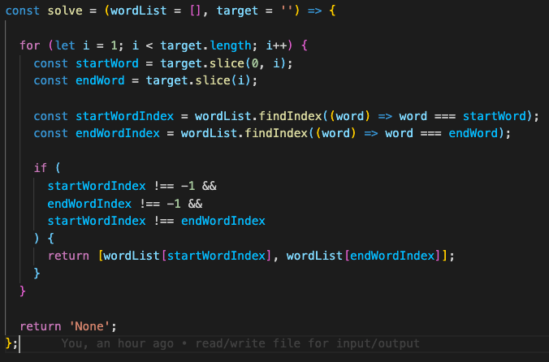

# How to run the code

## Required

- [Node](https://nodejs.org/en/) (version 15.x.x)

## Structure

```
.
|
├-- algo
     ├-- input
     |     ├-- target.txt  --------------------------------- ①
     |     ├-- word_list.txt  ------------------------------ ②
     |
     ├-- output
     |     ├-- solve_result.txt  --------------------------- ③
     |
     ├-- index.js
     ├-- solve.js
     ├-- ...

```

1.  Specify your input by put it into the text file under `input` directory

    - `target.txt` (ref. ①) - A target word (1 line)

    ```
    abcd
    ```

    - `word_list.txt`(ref. ②) - A list of distinct strings (multi line)\
      **_Note:_** _please provide one word for one line_\
      _ie. ["ab", "bc", "cd"] would be_

    ```
    ab
    bc
    cd
    ```

2.  Execute command
    ```bash
    $ node index.js
    ```
3.  The result will display on the console and be written at `solve_result.txt` (ref. ③)\
    inside `output` directory

# Code explanation



Starting from looping through a `target` word. What inside loop does is explained below.

1. Divide a `target` word into 2 segments which are called `startWord` and `endWord`

   > ie. target = “abcd”\
   > #1 (first iteration) -> `startWord`=“a” and `endWord`=“bcd”\
   > #2 (second iteration) -> `startWord`=“ab” and `endWord`=“cd”\
   >  .\
   >  .

2. Find an index of the element inside `wordList` that is the same as `startWord`\
    then, keep that index value into `startWordIndex` and do the same with `endWord`\
    then, keep it in `endWordIndex`

   _Note: The findIndex() method returns the index of the first element in the array that satisfies the provided testing function. Otherwise, it returns -1_

3. Check whether both words (`startWord` and `endWord`) were found or not by checking that\
   `startWordIndex` and `endWord` mustn't be -1 and make sure that they are not the same value\. (Because we can’t pick the same word in `wordList` twice)

## Complexity analysis

Assuming **m** is the size of `wordList` and **n** is the size of a `target`. We will get the following

```
T(m,n) = n * [ t(statement1) + t(statement2) ]
```

each statement represents the code explanation above

- statement1 - assume that .slice is O(1) so statement1 will be O(2), we can neglect
- statement2 - assume that .findIndex is a O(N), so statement2 will be O(2N) ≈ O(N)

```
T(m,n) = n * [ k + 2m ] ≈ n * [ 2m ] ≈ 2mn ≈ mn
```

**Therefore, the algorithm has `O(mn)` time complexity**
